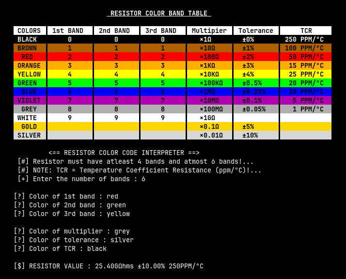

<h1 align="center"> RESISTOR COLOR CODE CALCULATOR </h1>

<p align="center"></p>


# 🚀 Getting Started

### Requirements

<em>
<code> ► gcc make cmake valgrind </code>
</em>


## ⚙️ Installation

### Clone the quizbit repository:

```sh
git clone https://github.com/msio808/rescal.git
```

### Change to the project directory:

```sh
cd rescal/config/
```

### 🤖 Running the project

```sh
./build.sh --run
```

### 🧪 Debug with GDB
```sh
./build.sh --debug
```

### 🧪 Debug with Valgrind
```sh
./build --memcheck
```

### 🗑 Clean generated build files
```sh
./build.sh --clean
```

# 📂 Folder Structure

```
.
├── config
│   ├── build.sh
│   └── CMakeLists.txt
├── docs
│   └── README.md
├── include
│   ├── helpers.h
│   └── src.h
├── LICENSE
└── src
    ├── helpers
    │   ├── helpers.c
    │   └── src.c
    └── main.c
```

---
<br>

# ⚠ If you want to run the program on windows

- Comment out the ```strings.h``` from the [```../include/src.h```](../include/src.h) file.
- Write your own custom ```strcasecmp()``` function.
- Unlike the ```strcmp()``` the ```strcasecmp()``` function is case-insensitive.

<details>
<summary>The code below might help</summary>

```c++
#include <ctype.h>
#include <stdint.h>

//? Custom implementation of strcasecmp
int strcasecmp(const char *str1, const char *str2) {
    while (*str1 && *str2) {
        const char ch1 = tolower((unsigned char)*str1);
        const char ch2 = tolower((unsigned char)*str2);
        if (ch1 != ch2) {
            return ch1 - ch2;
        }
        str1++;
        str2++;
    }

    return tolower((unsigned char)*str1) - tolower((unsigned char)*str2);
}
```
</details>